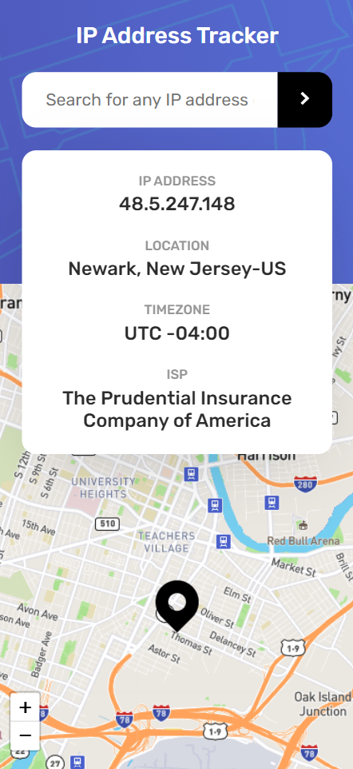

# Frontend Mentor - IP address tracker solution

This is a solution to the [IP address tracker challenge on Frontend Mentor](https://www.frontendmentor.io/challenges/ip-address-tracker-I8-0yYAH0). Frontend Mentor challenges help you improve your coding skills by building realistic projects. 

### The challenge

Users should be able to:

- View the optimal layout for each page depending on their device's screen size
- See hover states for all interactive elements on the page
- See their own IP address on the map on the initial page load
- Search for any IP addresses or domains and see the key information and location

### Screenshot

  

### Links

- Live Site URL: [Link](https://jonascavalcante.github.io/ip-address-tracker/)
- IP Geolocation API: [Link](https://geo.ipify.org/)
- Leaflet JavaScript Library: [Link](https://leafletjs.com/)

### Built with

- HTML5
- CSS3
- JavaScript

### Author

- LinkedIn - [@jonascavalcante](https://www.linkedin.com/in/jonascavalcante/)
- Frontend Mentor - [@jonascavalcante](https://www.frontendmentor.io/profile/jonascavalcante)